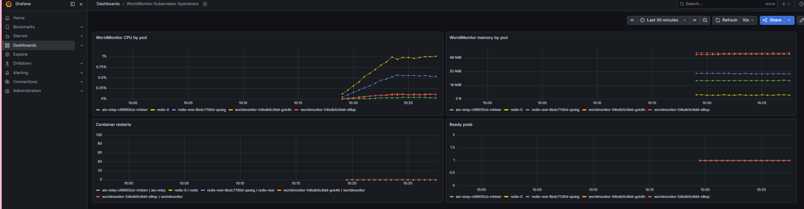
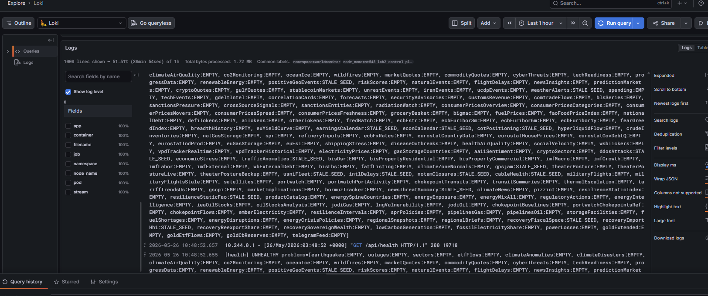
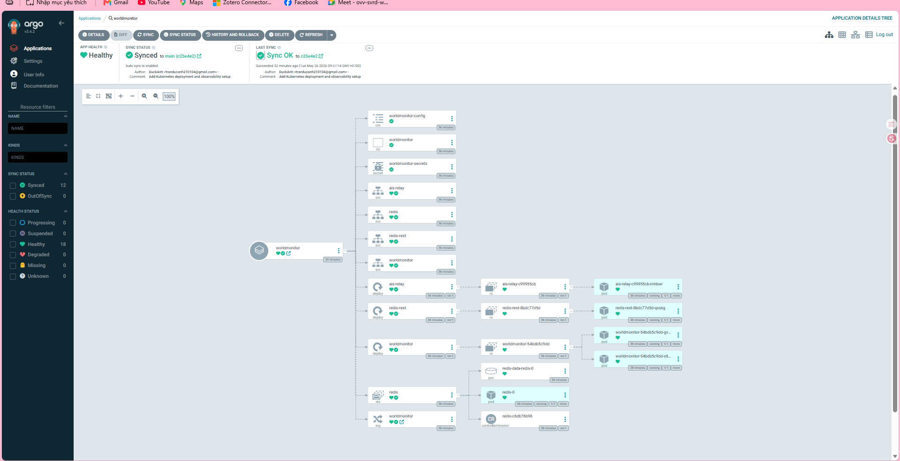
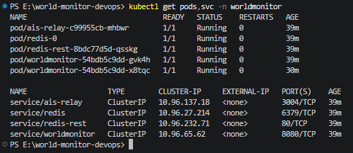
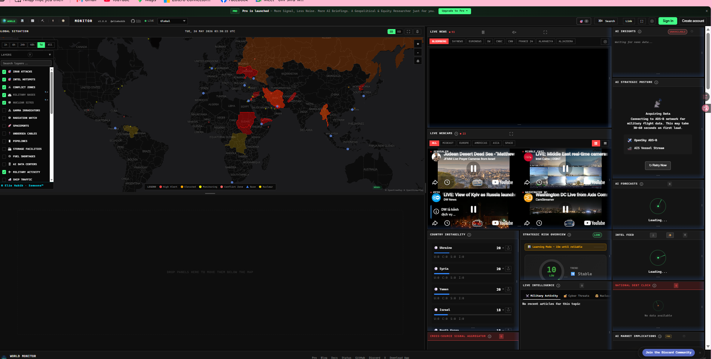
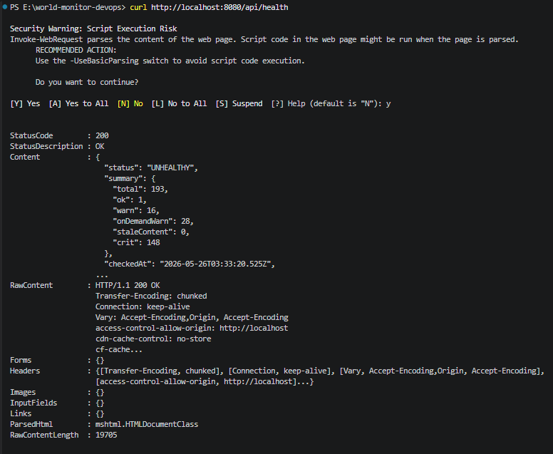
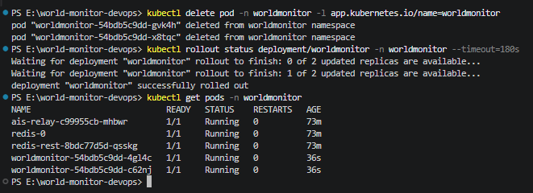

# ĐẠI HỌC QUỐC GIA THÀNH PHỐ HỒ CHÍ MINH

# TRƯỜNG ĐẠI HỌC CÔNG NGHỆ THÔNG TIN

# KHOA: [ĐIỀN TÊN KHOA]

## BÁO CÁO ĐỒ ÁN CUỐI KỲ

## Môn học: DevOps

## Tên đề tài

# Thiết kế và triển khai quy trình DevOps, DevSecOps và GitOps cho ứng dụng WorldMonitor microservices trên Kubernetes

**Giảng viên hướng dẫn:** [Điền tên giảng viên]

**Thành viên nhóm:**

| STT | MSSV | Họ và tên | Nhiệm vụ |
| --- | --- | --- | --- |
| 1 | [Điền MSSV] | [Điền họ tên thành viên 1] | CI/CD, DevSecOps, báo cáo |
| 2 | [Điền MSSV] | [Điền họ tên thành viên 2] | Kubernetes, GitOps, triển khai, kiểm thử |

**Lớp:** [Điền mã lớp]

**Năm học:** 2025-2026

**Thành phố Hồ Chí Minh, tháng 05 năm 2026**

## Tóm tắt

WorldMonitor là một hệ thống dashboard giám sát tình hình thế giới theo thời
gian gần thực. Ứng dụng tổng hợp và trực quan hóa dữ liệu về địa chính trị, quân
sự, kinh tế, an ninh mạng, khí hậu, hàng không, hàng hải và hạ tầng. Dự án gốc
đã có Dockerfile và một số thành phần runtime độc lập, nhưng chưa được tổ chức
thành một quy trình DevOps hoàn chỉnh để triển khai trên Kubernetes.

Đồ án này thiết kế và triển khai quy trình DevOps cho WorldMonitor trên
Kubernetes. Quy trình bao gồm tự động hóa CI/CD bằng GitHub Actions, tích hợp
DevSecOps với các bước SAST, dependency scanning, IaC scanning, container
scanning và DAST tùy chọn, triển khai GitOps bằng Argo CD, đồng thời bổ sung
monitoring/logging bằng Prometheus, Grafana, Loki và Promtail. Môi trường triển
khai mục tiêu là Kubernetes cục bộ như K3s hoặc Minikube, phù hợp cho trình
diễn cuối kỳ và kiểm thử có thể lặp lại.

Kết quả đạt được là một repository DevOps hoàn chỉnh gồm workflow CI/CD,
manifest Kubernetes, cấu hình GitOps, cấu hình quan sát hệ thống và các ảnh minh
chứng cho việc triển khai ứng dụng, kiểm tra health endpoint, thu thập log,
giám sát metrics và khả năng tự phục hồi khi pod bị xóa.

---

## Mục lục

1. Giới thiệu
2. Phân tích hiện trạng hệ thống
3. Kiến trúc DevOps mục tiêu
4. Thiết kế pipeline CI/CD
5. Tích hợp DevSecOps
6. Triển khai Kubernetes và GitOps
7. Monitoring và logging
8. Kiểm thử và kết quả thực nghiệm
9. Phân chia công việc
10. Hạn chế và hướng phát triển
11. Kết luận
12. Tài liệu tham khảo
13. Phụ lục

---

## 1. Giới thiệu

### 1.1 Bối cảnh

Các hệ thống phần mềm hiện đại cần khả năng phát hành nhanh, ổn định, có thể
lặp lại và có kiểm soát bảo mật. DevOps kết hợp giữa phát triển phần mềm và vận
hành hệ thống nhằm tự động hóa các bước build, test, release và deploy.
DevSecOps mở rộng DevOps bằng cách đưa kiểm tra bảo mật vào sớm trong vòng đời
phát triển. GitOps sử dụng Git làm nguồn sự thật cho trạng thái hạ tầng và triển
khai, giúp Kubernetes cluster tự động đồng bộ theo manifest đã được quản lý bằng
version control.

### 1.2 Mục tiêu đề tài

Mục tiêu của đồ án là thiết kế và triển khai quy trình DevOps cho WorldMonitor,
bao gồm:

- Tự động hóa CI/CD cho kiểm tra chất lượng, build image và publish image.
- Tích hợp các bước DevSecOps vào pipeline.
- Triển khai các service của ứng dụng lên Kubernetes.
- Quản lý triển khai bằng GitOps thông qua Argo CD.
- Bổ sung monitoring và logging phục vụ vận hành.
- Cung cấp bằng chứng thực nghiệm cho quá trình triển khai và kiểm thử.

### 1.3 Phạm vi thực hiện

Đồ án tập trung vào khía cạnh DevOps và vận hành hệ thống. Nhóm không refactor
logic nghiệp vụ của ứng dụng và không tách toàn bộ API domain thành các
microservice mới. Thay vào đó, nhóm ánh xạ các thành phần runtime hiện có thành
mô hình microservices thực dụng trên Kubernetes.

---

## 2. Phân tích hiện trạng hệ thống

### 2.1 Tổng quan WorldMonitor

WorldMonitor là một ứng dụng single-page application viết bằng TypeScript/Vite,
có các API handler phía server và các service phụ trợ. Ứng dụng cung cấp giao
diện giám sát tình hình toàn cầu với bản đồ, panel dữ liệu, live feed và nhiều
tích hợp dữ liệu bên ngoài.

### 2.2 Các thành phần runtime hiện có

Repository có các thành phần có thể triển khai độc lập như sau:

| Thành phần | Mô tả |
| --- | --- |
| `worldmonitor` | Container chính, phục vụ SPA và local API sidecar |
| `ais-relay` | Service relay và seed dữ liệu cho AIS, RSS/OREF và một số nguồn dữ liệu |
| `redis-rest` | REST proxy giúp ứng dụng truy cập Redis theo giao diện tương thích Upstash |
| `redis` | Stateful cache lưu dữ liệu, metadata freshness và trạng thái rate limit |

### 2.3 Ánh xạ sang mô hình microservices thực dụng

Ứng dụng gốc không phải một hệ thống microservices thuần theo từng domain API.
Trong phạm vi đồ án, kiến trúc được chuyển sang mô hình Kubernetes
microservices thực dụng:

```text
Trình duyệt người dùng
    |
    v
worldmonitor Service
    |-- phục vụ SPA
    |-- proxy /api/* tới local API sidecar
    |
    +--> redis-rest Service --> Redis StatefulSet
    |
    +--> ais-relay Service
```

Mô hình này đủ để thể hiện các nội dung trọng tâm của đồ án: DevOps,
DevSecOps, GitOps, triển khai Kubernetes, monitoring, logging và kiểm thử vận
hành.

---

## 3. Kiến trúc DevOps mục tiêu

### 3.1 Kiến trúc tổng thể

```text
Developer
   |
   v
GitHub Repository
   |
   +--> GitHub Actions CI/CD
   |       |-- kiểm tra chất lượng
   |       |-- quét bảo mật
   |       |-- build Docker image
   |       +-- publish image lên GHCR
   |
   +--> Kubernetes manifests
           |
           v
        Argo CD
           |
           v
      K3s/Minikube Cluster
           |
           +-- worldmonitor
           +-- ais-relay
           +-- redis-rest
           +-- redis
           +-- Prometheus/Grafana
           +-- Loki/Promtail
```

### 3.2 Cấu trúc repository được bổ sung

| Đường dẫn | Vai trò |
| --- | --- |
| `.github/workflows/devsecops.yml` | Quality gates và security scanning |
| `.github/workflows/container-publish.yml` | Build và publish image lên GHCR |
| `deploy/kubernetes/` | Kubernetes manifests và Argo CD Application |
| `deploy/monitoring/` | Cấu hình Prometheus, Grafana, Loki, Promtail |
| `docs/devops/` | Tài liệu kiến trúc, pipeline, DevSecOps và báo cáo |

---

## 4. Thiết kế pipeline CI/CD

### 4.1 Workflow kiểm tra chất lượng

Workflow `devsecops.yml` chạy khi có pull request, khi push vào `main` và khi
chạy thủ công. Workflow này thực hiện:

- Cài đặt dependencies bằng Node.js 22.
- Lint mã nguồn.
- Typecheck TypeScript.
- Typecheck API.
- Chạy unit/data tests.
- Chạy sidecar tests.

### 4.2 Workflow publish container image

Workflow `container-publish.yml` build và publish các image sau lên GitHub
Container Registry:

| Image | Dockerfile nguồn |
| --- | --- |
| `ghcr.io/<owner>/worldmonitor-app` | `Dockerfile` |
| `ghcr.io/<owner>/worldmonitor-ais-relay` | `Dockerfile.relay` |
| `ghcr.io/<owner>/worldmonitor-redis-rest` | `docker/Dockerfile.redis-rest` |

Workflow hỗ trợ hai loại tag:

- `sha-<commit-sha>` để triển khai có thể truy vết chính xác.
- `main-latest` cho image mới nhất từ nhánh `main`.

Trong môi trường thử nghiệm Kubernetes hiện tại, manifest sử dụng `main-latest`
cho `worldmonitor-app` và `redis-rest`, còn `ais-relay` dùng image cục bộ
`worldmonitor-ais-relay:local`. Với môi trường production, nhóm khuyến nghị pin
image bằng tag `sha-<commit-sha>` để bảo đảm tính tái lập của GitOps.

### 4.3 Luồng promotion theo GitOps

Luồng promotion mong muốn:

1. Code được merge vào `main`.
2. GitHub Actions build và publish image.
3. Kubernetes manifest tham chiếu image tag được chọn.
4. Argo CD phát hiện thay đổi trong Git.
5. Argo CD đồng bộ cluster về trạng thái mong muốn.

---

## 5. Tích hợp DevSecOps

### 5.1 SAST

SAST (Static Application Security Testing) được thực hiện bằng Semgrep default
rules. Pipeline xuất report `semgrep.json` dưới dạng artifact CI và fail khi có
finding nghiêm trọng.

### 5.2 Dependency scanning

Dependency scanning được thực hiện bằng `npm audit` cho ứng dụng chính và các
package phụ trợ. Workflow fail khi phát hiện lỗ hổng mức high/critical có bản vá
hoặc hướng xử lý khả dụng.

### 5.3 IaC và Dockerfile scanning

Trivy config scanning được dùng để kiểm tra Dockerfile và cấu hình hạ tầng. Bước
này giúp phát hiện cấu hình container hoặc manifest thiếu an toàn trước khi
triển khai.

### 5.4 Container image scanning

Trivy image scanning được chạy sau khi build image ứng dụng chính. Workflow bỏ
qua các lỗ hổng chưa có bản vá và chặn các lỗ hổng high/critical có hướng xử lý.

### 5.5 DAST

DAST (Dynamic Application Security Testing) được hỗ trợ bằng OWASP ZAP baseline
scan thông qua workflow dispatch thủ công. Bước này cần URL đã deploy, vì vậy
được chạy sau khi người triển khai expose ứng dụng trong môi trường Kubernetes.

---

## 6. Triển khai Kubernetes và GitOps

### 6.1 Tài nguyên Kubernetes

Phần triển khai Kubernetes bao gồm:

- Namespace: `worldmonitor`.
- ConfigMap: cấu hình runtime không nhạy cảm.
- Secret template: mật khẩu/token Redis, relay secret và các API key tùy chọn.
- Deployments: `worldmonitor`, `ais-relay`, `redis-rest`.
- StatefulSet: `redis`.
- Services: ClusterIP service cho từng thành phần runtime.
- Ingress: `worldmonitor.local` thông qua Traefik.

### 6.2 Health checks và resource control

Manifest có readiness probe và liveness probe:

| Service | Probe |
| --- | --- |
| `worldmonitor` | HTTP `/api/health` trên port 8080 |
| `ais-relay` | HTTP `/health` trên port 3004 |
| `redis-rest` | TCP probe trên port 80 |
| `redis` | `redis-cli ping` với password |

Manifest cũng khai báo CPU/memory requests và limits, `RuntimeDefault` seccomp
profile, tắt privilege escalation và drop Linux capabilities.

### 6.3 Argo CD

Argo CD Application trỏ tới:

```text
Repository: https://github.com/Youngboy1609/world-monitor-devops.git
Revision: main
Path: deploy/kubernetes
Namespace: worldmonitor
```

Automated sync được bật với `prune` và `selfHeal`.

---

## 7. Monitoring và logging

### 7.1 Prometheus và Grafana

Dự án bổ sung Helm values cho `kube-prometheus-stack`. Grafana được dùng để
theo dõi:

- CPU usage theo pod.
- Memory usage theo pod.
- Số lần container restart.
- Trạng thái ready của pod.



### 7.2 Loki và Promtail

Dự án bổ sung Helm values cho Loki và Promtail. Loki lưu trữ log ứng dụng, còn
Promtail thu thập log từ các Kubernetes pod.



---

## 8. Kiểm thử và kết quả thực nghiệm

### 8.1 Kết quả đồng bộ GitOps

Argo CD hiển thị ứng dụng `worldmonitor` ở trạng thái `Healthy` và `Synced`.
Ứng dụng được đồng bộ tới commit `c25e4e24`, là commit bổ sung Kubernetes
deployment và observability setup.



### 8.2 Trạng thái runtime trên Kubernetes

Cluster hiển thị đầy đủ pod và service cần thiết trong namespace
`worldmonitor`:

- `ais-relay`.
- `redis`.
- `redis-rest`.
- Hai replica `worldmonitor`.



### 8.3 Kiểm thử giao diện ứng dụng

Giao diện WorldMonitor tải thành công thông qua service đã triển khai. Kết quả
này xác nhận frontend và backend sidecar có thể truy cập được từ trình duyệt.



### 8.4 Kiểm thử health endpoint

Endpoint `/api/health` trả về HTTP 200. Payload tổng thể báo `UNHEALTHY` vì môi
trường thử nghiệm cục bộ chưa cấu hình đầy đủ API key hoặc dữ liệu seed cho toàn
bộ nguồn dữ liệu live. Đây là kết quả chấp nhận được trong phạm vi kiểm chứng
DevOps: service ứng dụng vẫn reachable, và health endpoint phản ánh đúng trạng
thái freshness của dữ liệu.



### 8.5 Kiểm thử logging

Loki hiển thị log từ namespace `worldmonitor`, bao gồm request
`GET /api/health` và các dòng log health status. Điều này xác nhận log từ pod đã
được thu thập về hệ thống logging tập trung.

### 8.6 Kiểm thử self-healing

Nhóm xóa các pod `worldmonitor` bằng label selector. Kubernetes tự tạo lại pod
mới, và lệnh `kubectl rollout status deployment/worldmonitor` kết thúc thành
công với hai replica available.



---

## 9. Phân chia công việc

### 9.1 Thành viên 1

Thành viên 1 đã hoàn thành:

- Thiết kế workflow CI/CD.
- Tích hợp workflow DevSecOps.
- Tạo workflow publish container image lên GHCR.
- Viết tài liệu kiến trúc, pipeline, DevSecOps và báo cáo.

### 9.2 Thành viên 2

Thành viên 2 đã hoàn thành:

- Kubernetes manifests cho `worldmonitor`, `ais-relay`, `redis-rest` và
  `redis`.
- Argo CD Application cho triển khai GitOps.
- Cấu hình Prometheus/Grafana và Loki/Promtail.
- Ảnh minh chứng quá trình triển khai.
- Kiểm thử health check, logging, dashboard và self-healing.

---

## 10. Hạn chế và hướng phát triển

### 10.1 Hạn chế

- Kiến trúc triển khai sử dụng cách tách service thực dụng, chưa refactor từng
  API domain thành microservice độc lập.
- Môi trường thử nghiệm cục bộ dùng giá trị cấu hình mẫu hoặc thiếu một số API
  key tùy chọn, nên một số health check dữ liệu báo stale hoặc missing.
- DAST cần URL đã deploy nên phải chạy thủ công sau khi expose service.
- Cấu hình Kubernetes hiện phù hợp cho thử nghiệm cục bộ; môi trường production
  cần quản lý secret chặt hơn, TLS, chính sách persistent storage và
  NetworkPolicy.

### 10.2 Hướng phát triển

- Bổ sung Kustomize overlay hoặc Helm chart cho staging/production.
- Tích hợp NetworkPolicy và External Secrets.
- Bổ sung Argo Rollouts cho progressive delivery.
- Bổ sung ServiceMonitor cho metrics đặc thù của ứng dụng.
- Mở rộng container scanning cho toàn bộ runtime image.
- Xuất báo cáo theo mẫu chính thức của khoa/trường khi có tài liệu mẫu được
  cung cấp.

---

## 11. Kết luận

Đồ án đã thiết kế và triển khai thành công quy trình DevOps cho WorldMonitor
trên Kubernetes. Workflow CI/CD tự động hóa kiểm tra chất lượng và bảo mật, đồng
thời chuẩn bị image cho triển khai. Kubernetes manifests định nghĩa các service
runtime, Argo CD quản lý đồng bộ GitOps, còn monitoring/logging cung cấp khả
năng quan sát trong quá trình vận hành.

Bằng chứng thực nghiệm cho thấy ứng dụng đã được triển khai, được Argo CD đồng
bộ, truy cập được qua trình duyệt, quan sát được qua Grafana và Loki, đồng thời
có khả năng tự phục hồi sau khi pod bị xóa. Dù môi trường thử nghiệm chưa có
toàn bộ API key tùy chọn nên health endpoint vẫn báo một số cảnh báo dữ liệu,
các mục tiêu chính về DevOps, DevSecOps và GitOps đã được đáp ứng.

---

## 12. Tài liệu tham khảo

1. Khoa Công nghệ Phần mềm, UIT. "Thông báo nộp báo cáo Khóa luận tốt nghiệp
   đợt 1 năm học 2024-2025." Thông báo nêu yêu cầu mỗi đề tài nộp một file PDF
   theo mẫu trình bày khóa luận tốt nghiệp và quy tắc đặt tên file.
   <https://se.uit.edu.vn/en/tin-tuc/10-thong-bao-hoc-vu/1809-th%C3%B4ng-b%C3%A1o-n%E1%BB%99p-b%C3%A1o-c%C3%A1o-kh%C3%B3a-lu%E1%BA%ADn-t%E1%BB%91t-nghi%E1%BB%87p-%C4%91%E1%BB%A3t-1-n%C4%83m-h%E1%BB%8Dc-2024-2025.html>

2. Khoa Kỹ thuật Máy tính, UIT. "Thông báo nộp Khóa luận tốt nghiệp sau bảo vệ
   học kỳ 1 năm học 2024-2025." Thông báo liệt kê các artifact như báo cáo
   PDF/DOCX, báo cáo tóm tắt, slide, thiết kế và video minh họa nếu có.
   <https://fce.uit.edu.vn/thong-bao-ve-viec-nop-khoa-luan-tot-nghiep-hoc-ky-1-nam-hoc-2024-2025-ban-sau-bao-ve/>

3. Khoa Hệ thống Thông tin, UIT. "Mẫu mới biểu mẫu khóa luận tốt nghiệp." Thông
   báo cho biết biểu mẫu mới nhất có thể tải tại mục biểu mẫu nội bộ trên DAA.
   <https://httt.uit.edu.vn/mau-moi-bieu-mau-khoa-luan-tot-nghiep/>

4. Khoa Mạng máy tính và Truyền thông, UIT. "Thông báo về việc nộp báo cáo Đồ
   án chuyên ngành." Thông báo mô tả việc nộp báo cáo đồ án và quy tắc đặt tên
   file.
   <https://nc.uit.edu.vn/tin-tuc/thong-bao-hoc-vu/thong-bao-ve-viec-nop-bao-cao-do-an-chuyen-nganh.html>

5. Kubernetes Documentation. <https://kubernetes.io/docs/>

6. Argo CD Documentation. <https://argo-cd.readthedocs.io/>

7. Trivy Documentation. <https://aquasecurity.github.io/trivy/>

8. Semgrep Documentation. <https://semgrep.dev/docs/>

9. OWASP ZAP Documentation. <https://www.zaproxy.org/docs/>

---

## 13. Phụ lục

### Phụ lục A. Các commit chính

| Commit | Nội dung |
| --- | --- |
| `ad9cce4d` | Bổ sung CI/CD, DevSecOps và tài liệu ban đầu |
| `c25e4e24` | Bổ sung Kubernetes deployment và observability setup |
| `740a6d2a` | Bổ sung báo cáo UIT và ảnh minh chứng |
| `5d9cf622` | Xuất bản PDF báo cáo cuối kỳ |

### Phụ lục B. Danh sách ảnh minh chứng

| Minh chứng | File |
| --- | --- |
| Dashboard Grafana | `docs/devops/assets/grafana-dashboard.png` |
| Argo CD Healthy/Synced | `docs/devops/assets/argocd-healthy-synced.png` |
| Giao diện WorldMonitor sau deploy | `docs/devops/assets/worldmonitor-ui.png` |
| Kubernetes pods/services | `docs/devops/assets/kubectl-pods-services.png` |
| Kết quả `/api/health` | `docs/devops/assets/health-endpoint.png` |
| Log Loki | `docs/devops/assets/loki-logs.png` |
| Kiểm thử self-healing | `docs/devops/assets/self-healing-rollout.png` |
